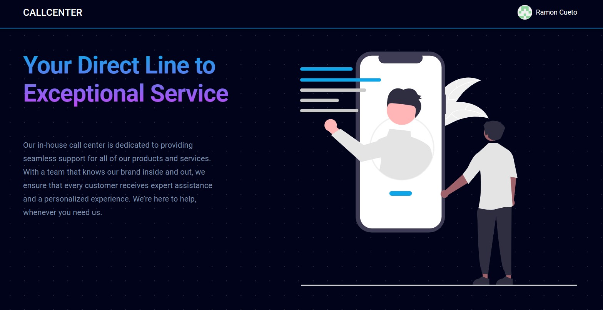

# CallCenter

**Проект создан командой разработчиков при участии:**
- [KOJSok](https://github.com/kojsok): управление проектом в роли midle front end разработчик и product manager, основная концепция, контроль структуры, выбор технологий и стека, разработка полной валидации и взаимодействие с сервером, создание основного API-интерфейса, работа с асинхронными запросами и построение графиков и многое др.
- [NeleNik](https://github.com/Nelenik): разработка проекта в роли midle front-end разработчик, разработка backend-части, структурирование данных и взаимодействие с backend, контроль соблюдения архитектурных принципов, работа с REST API, построение сложных эндпоинтов для более глубокой аналитики и реализация кэширования данных, разработка модуля авторизации и многое др.





### Описание проекта
**CallCenter** — это веб-приложение, разработанное для упрощения управления и анализа данных, связанных с работой колл-центров. Проект позволяет эффективно обрабатывать информацию о звонках, отслеживать статистику, фиксировать настроения клиентов и добавлять комментарии от агентов. Интерфейс предоставляет аналитические инструменты, такие как графики и таблицы, для визуализации данных, что помогает в принятии решений и повышении качества обслуживания клиентов.

**Разработка проекта велась в строгом соответствии с методологией Agile**, что позволило команде четко планировать и координировать задачи на каждом этапе, обеспечивая высокую производительность и гибкость. Каждый этап был детально проработан, включая регулярные совещания, итеративное планирование и демонстрации прогресса. Такой подход позволил команде оперативно реагировать на новые требования и улучшения. Тщательное планирование и тесное взаимодействие между участниками проекта позволили своевременно внедрять улучшения и исправления.

Проект прошел несколько спринтов, где каждая задача распределялась в зависимости от приоритетов и выделенного времени. В ходе разработки основное внимание уделялось качеству кода, своевременной обратной связи, что помогло создать масштабируемое приложение.

### Технический стек
- **React**: Используется для создания пользовательского интерфейса и управления состоянием приложения.
- **Zod**: Применяется для валидации данных, полученных от API.
- **React Query**: Для работы с асинхронными запросами и кэширования данных.
- **Recharts**: Библиотека для создания интерактивных графиков и визуализации данных.
- **Material UI**: Для создания настраиваемых и удобных компонентов интерфейса.
- **React Router**: Обеспечивает маршрутизацию внутри приложения.
- **Lucide-React**: Используется для интеграции иконок в интерфейсе.
- **Axios**: Для отправки запросов к API и получения данных.
- **TailwindCSS**: Используется для стилизации компонентов и создания адаптивного интерфейса.

### Установка и запуск проекта

1. Клонируйте репозиторий на ваш локальный компьютер:
   ```bash
   git clone https://github.com/your-username/callcenter.git
   ```

2. Перейдите в папку проекта:
   ```bash
   cd callcenter
   ```

3. Установите зависимости:
   ```bash
   npm install
   ```

4. Для работы с данными используйте и настройте JSON Server. JSON server размещене в корне папки проекта.  Установите его глобально, если он ещё не установлен (более детальная установка и настройка JSON сервера находится в папке /json-server/readme.md):
   ```bash
   npm install -g json-server
   ```

5. Запустите JSON Server с файлом данных:
   ```bash
   json-server --watch db.json --port 4000
   ```
   > **Примечание**: Убедитесь, что файл `db.json` настроен в корневом каталоге проекта, чтобы данные корректно загружались.

6. Запустите проект:
   ```bash
   npm start
   ```

7. Откройте [http://localhost:3000](http://localhost:3000) в браузере, чтобы увидеть приложение.


### Планы по развитию
В дальнейшем планируется расширить функциональность приложения, добавив панель администратора для управления пользователями и их ролями, раздел настроек интерфейса для индивидуальной настройки элементов под нужды пользователя, а также несколько информационных страниц, включая страницу "О проекте" (About) и страницу для обратной связи (Feedback). Эти улучшения помогут сделать приложение более гибким и удобным, а также расширят возможности взаимодействия с пользователями.
